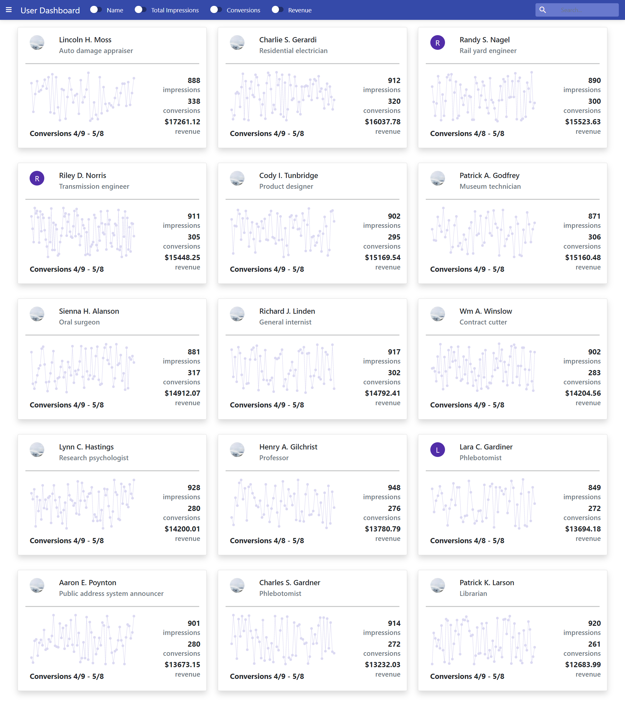

# `Tune Challenge App`

----------

## Getting started

### Installation

Please check the official laravel installation guide for server requirements before you start. [Official Documentation](https://laravel.com/docs/5.4/installation#installation)

Reuirements
Php version >=`8.0.1 `

#### Composer >= 2.0.1 
Clone the repository

    git clone git@github.com:DaniyalShafiq205/Tune-Task.git

Switch to the repo folder

    cd Tune-Task

Install all the dependencies using composer

    composer install

Copy the example env file and make the required configuration changes in the .env file

    cp .env.example .env

Generate a new application key

    php artisan key:generate

Run the `database migrations` (**Set the database connection in .env before migrating**)

    php artisan migrate
### Database seeding

**Populate the database with seed data with relationships which includes users, logs. This can help you to quickly start testing the api or couple a frontend and start using it with ready content.**
- But As `LogsSeeder` takes a bit more time so be patient it takes few mins

Run the database seeder 

    php artisan db:seed

Start the local development server

    php artisan serve

You can now access the server at `http://127.0.0.1:8000`
    

## Test Run
Run the Test Cases Coverage As more than `80%` coverage is Done

    Make a Testing Database Name as per .env.testing file

    Run `php artisan test --coverage`

## Note
As the provided `S3` link is invalid so right now I put some `dummy images` on links and on null it shows `First Character` as per Requirement.

Plus On Dashboard I load Just `15` users and there data for chart If want to `increase` then just 
`App\Repositories\DashboardRepository` in 
- `getChartData` method Update `[user_id]` and increase `[limit]` or maybe just remove and same for 
- `getUserData` method increase `[id]` value in where clause or maybe just remove this clause as per requirement

